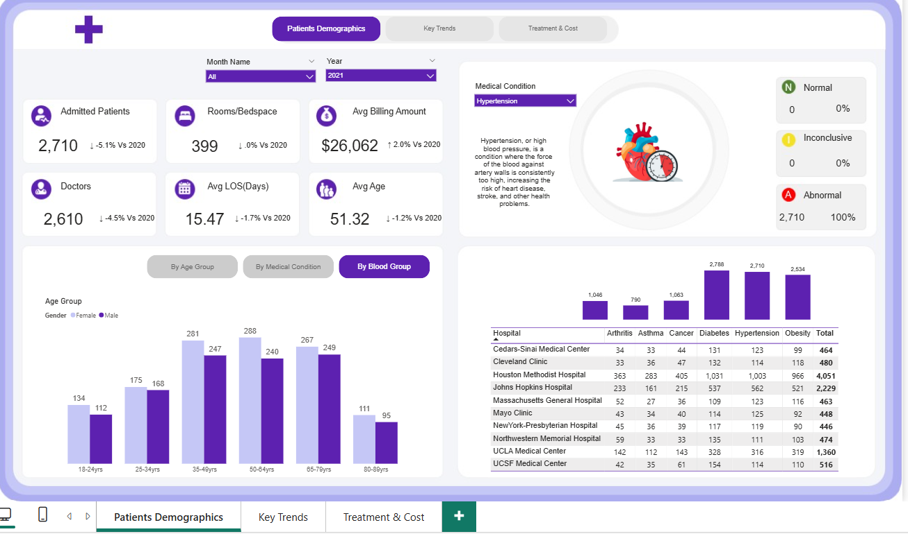
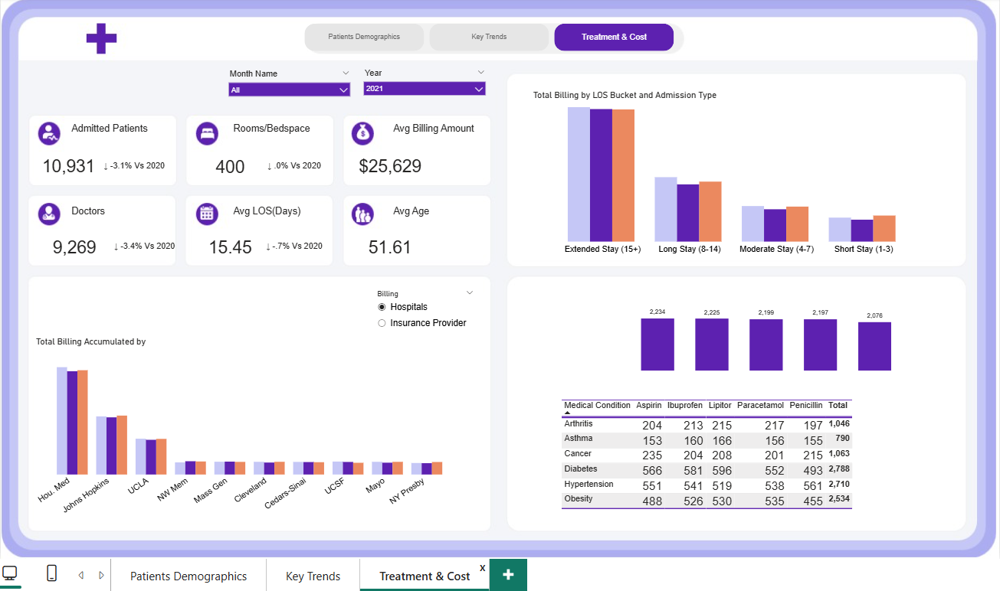
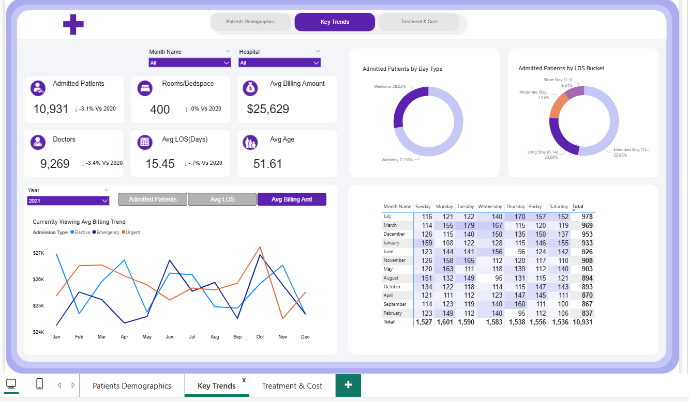

# 📊 National Health Report Dashboard – Power BI

A fully interactive Power BI dashboard designed to analyze **patient trends, healthcare costs, and hospital performance** across the United States.  
This project was inspired by my experience working as a **U.S. Healthcare Data Analyst** and the challenges I observed with fragmented healthcare data.

---

  
  
  

## 🔍 Problem Statement

In many healthcare systems, data related to **patients, billing, length of stay, medical conditions, and hospital operations** is stored across separate systems.  
This leads to:

- Delayed or inconsistent decision-making  
- Difficulty identifying trends  
- Limited visibility into treatment costs  
- No unified view for comparing hospitals or conditions  

Healthcare teams needed a single, centralized tool to explore insights clearly and interactively.

---

## 🛠️ My Solution

I created a **three-page interactive Power BI dashboard** that consolidates patient, billing, and operational data into one streamlined analytics experience.

### **Dashboard Pages**
1. **Patient Demographics**  
2. **Key Trends**  
3. **Treatment & Cost Analysis**

### **Key Features**
- Dynamic filtering by **Year, Hospital, Medical Condition**  
- Year-over-Year KPI comparisons  
- Length of Stay (LOS) bucket analysis  
- Hospital performance comparison  
- Condition-specific insights (e.g., Asthma)  
- Billing breakdown by insurance provider  
- Page navigation and bookmarks for smooth transitions  
- Interactive visuals that update in real time  

---

## 🎯 Technical Highlights

### **Power BI Techniques Used**
- KPI Cards with YoY comparisons  
- Field Parameters for metric switching  
- Bookmarks for interactive navigation  
- Page Navigator for clean UI design  
- Drill-through pages & tooltips  
- Data modeling and relationship design  

### **DAX Measures Implemented**
- YoY % Change  
- Average LOS  
- LOS Bucket Categorization  
- Billing & Revenue Measures  
- Patient Segmentation (Gender, Age Group)  

---

## 🎥 Project Demo

I created a short video demonstrating:  
- The problem  
- How I solved it  
- Key dashboard interactions  

👉 *Check on my linkden or in my repo*

---

## 🧠 What I Learned

A huge thank you to **Zefas BI & Analytics** on YouTube — his tutorials helped me understand:

- KPI design  
- How to use **field parameters**  
- Page navigation + bookmarks  
- Clean Power BI layouts  
- Practical DAX implementation  

His channel played a big role in building this project.

---

---

## 🚀 How to Use

1. Clone or download the repository  
2. Open the `health_dashboard.pbix` file in Power BI Desktop  
3. Update dataset paths if using local files  
4. Interact with slicers, charts, and navigation buttons  

---

## 📌 Future Enhancements
- Add predictive analytics  
- Expand medical-condition categories  
- Integrate near real-time APIs  
- Add automated alerts using Power Automate  

---

## 🤝 Credits

- **Dashboard Design & Development:** Amisha Dahal  
- **Learning Inspiration:** Zefas BI & Analytics (YouTube)  

---

## 📬 Contact

**LinkedIn:** *[(https://www.linkedin.com/in/amishadahal/)](https://www.linkedin.com/in/amishadahal/)*  
Feel free to connect if you're interested in healthcare analytics, Power BI, or dashboard design!

